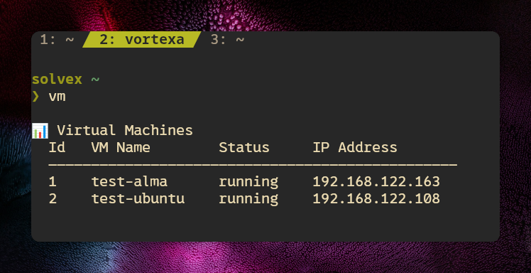

# KVM VM Provisioner

[](https://www.gnu.org/software/bash/)
[](https://www.python.org/)
[](https://www.linux-kvm.org/)
[](https://fedoraproject.org/)

> Automate cloud-init virtual machine lifecycle on Fedora KVM — like AWS EC2, but local.

## Features

- **Multi-distro** — Ubuntu and AlmaLinux with automatic version discovery from upstream APIs
- **Full lifecycle** — `vm run` | `start` | `stop` | `destroy` | `list` | `ip` | `prune`
- **SSH key UX** — auto-creates `id_ed25519` if missing, or picks from existing keys
- **Offline mode** — works with cached cloud images when no internet
- **Integrity verification** — SHA256 checksum on every downloaded image
- **Virtualization toggle** — `kvm on` / `kvm off` to enable or disable all virt services
- **Dry-run prune** — preview reclaimable space before deleting orphaned files

## Quick Start

1. Install KVM and virtualization services
```sh
chmod +x install/install-kvm-amd.sh && ./install/install-kvm-amd.sh
```

2. Log out and back in (or: newgrp libvirt) for group changes to apply

3. Add shell wrappers to ~/.bashrc
```sh
kvm () 
{ 
    "$HOME/kvm-vm-provisioner/scripts/kvm-toggle.sh" "$@"
}
```

```sh
vm () 
{ 
    "$HOME/kvm-vm-provisioner/scripts/vm-creator.sh" "$@"
}
```
Reload Shell
```sh
source ~/.bashrc
```

# 4. Create your first VM

```sh
vm run
```

## Architecture

```
┌─────────────────────────────────────┐
│          kvm-toggle.sh              │
│  kvm on → unmask + enable + start   │
│  kvm off → shutdown + disable + mask│
│  kvm    → show service status       │
└──────────┬──────────────────────────┘
           │
           ▼
┌─────────────────────────────────────┐
│          vm-creator.sh              │
│  Interactive wizard for:            │
│  Name → Distro → Version → SSH      │
│  ↓                                  │
│  Download → SHA256 verify → Clone   │
│  ↓                                  │
│  Cloud-init ISO → virt-install      │
│  ↓                                  │
│  DHCP IP detection → SSH command    │
└──────────┬──────────────────────────┘
           │
           ▼
┌─────────────────────────────────────┐
│     Libvirt / KVM / cloud-init      │
│  NAT network · DHCP · seed ISO      │
│  user-data + meta-data → NoCloud    │
└─────────────────────────────────────┘
```

## Project Structure

```
kvm-vm-provisioner/
├── README.md
├── install/
│   └── install-kvm-amd.sh        # KVM setup on Fedora
├── scripts/
│   ├── kvm-toggle.sh             # Toggle virtualization services
│   ├── vm-creator.sh             # VM lifecycle CLI
│   └── _vm_cloudinit.py          # Cloud-init user-data generator
├── lib/
│   └── common.sh                 # Bash logging helpers
├── docs/
│   ├── Screenshot.png            # Terminal demo screenshot
│   └── runbook.md                # Full session documentation
```

## Usage



* Create VMs using the distor name
```sh
vm run alma
```
```sh
vm run ubuntu
```

# List all VMs with IPs and status
```sh
vm
```

# Stop, start, destroy
```sh
vm stop my-vm
```
```sh
vm start my-vm
```
```sh
vm destroy my-vm
```

# Show IP of a running VM
```sh
vm ip my-vm
```

# Clean up orphaned files and unused cloud images
```sh
vm prune --dry-run
```
```sh
vm prune
```

## Design Decisions

- **`confirm()` defaults to No** — safe default for destructive actions (destroy, prune)
- **Version discovery** — live API for Ubuntu, mirror scrape for AlmaLinux, cached offline
- **Two-phase prune** — separates orphan VM files from reusable cloud images

## Requirements

- Fedora (tested on 44) or RHEL-compatible
- AMD64 architecture
- `install/install-kvm-amd.sh` run successfully (handles packages, groups, permissions)
- Shell wrappers added to `~/.bashrc`

## Related

- [docs/runbook.md](docs/runbook.md) — full configuration and setup walkthrough with errors and troubleshooting
